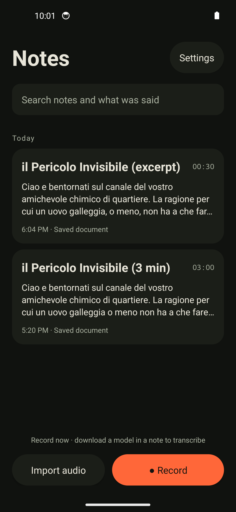
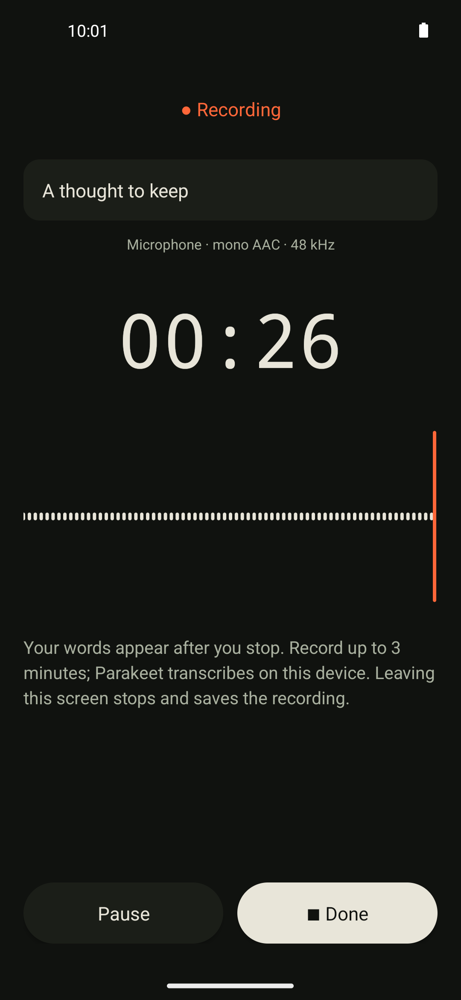
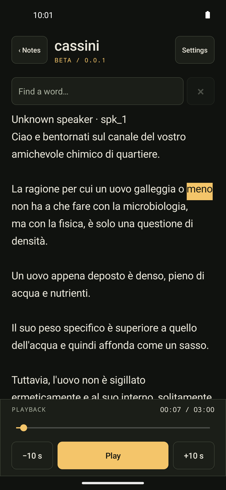

# Cassini for Android

Record a thought, find the words later, and keep the audio with the transcript. I’m building Cassini around that simple flow, with transcription running on your phone.

**[Download 0.0.6-beta](https://github.com/codemyriad/cassini-android/releases/download/v0.0.6-beta/cassini-android-0.0.6-beta.apk)** · [Release notes](https://github.com/codemyriad/cassini-android/releases/tag/v0.0.6-beta)

<p>
  
  
  
</p>

## Requirements

* **Android:** 8.0+ to install; creating Cassini files needs **10+ and a working [platform Opus encoder](https://developer.android.com/media/platform/supported-formats)**. Some emulator images lack that encoder. Existing documents can still be read.
* **Processor:** a 64-bit ARM phone (`arm64-v8a`) running 64-bit Android. The APK also includes `x86_64` for emulators. It does not support 32-bit ARM or x86 systems. Transcription runs on CPU; no GPU/NPU is required.
* **RAM (recommended):** **4 GB+**. This is a starting recommendation, not a tested minimum. Short-clip INT8 process memory peaked at about 1.02 GiB on the Pixel; longer clips and other apps need additional memory.
* **Free storage:** allow **1 GiB** for the models, plus space for recordings. The one-time download is about 730 MiB. Reading existing documents needs no model.

I’ve tested recording and transcription on a **Pixel 8 (8 GB RAM, Android 17)**; see [device results](docs/pixel8-results.md). An Android 14 x86_64 emulator has also passed recording/transcription checks. Other physical phones haven’t been verified end to end. Installation alone doesn’t guarantee usable transcription speed or enough memory.

## Try it

* Install the APK, open a note, then tap **Transcribe**. The first time, the app asks to download the models once (about 730 MiB: Parakeet v3 INT8, the speaker model and the voice model). After download, audio processing works offline.
* Tap **Record**, allow microphone access, then **Done**. You can pause and resume. Transcription starts when the model is ready. Or import WAV, MP3, M4A/AAC or Ogg Opus and tap **Transcribe**. While it works you see how far along it is, how fast it’s going and roughly how long is left, and draft words show up as each chunk is decoded.
* Browse **Notes** or search titles and past transcriptions. Tap a word to hear that part of the recording. Each note remembers its playback position.
* Use **Save Cassini** to keep a complete `.opus` document containing audio, timed words and metadata. You can open it again without downloading a model. This is a portable recording, not just a word-body JSON export.

The interface supports English and Italian. Parakeet recognizes speech languages automatically; the current transcript metadata labels the language as Italian.

## What’s still limited

This is an early beta. Recordings and imports for transcription can be up to **2 hours**. Recording runs in a foreground service with a notification: it keeps going with the screen off or the app in the background, and a recording cut short by a crash is repaired the next time the app starts. Transcription and speaker identification still need the app open. If they stop, nothing is saved and they start again from the beginning. On a Pixel 8, decoding the audio of a one-hour recording alone takes about 9 minutes (about 6× realtime) before recognition starts. Failed transcription keeps the recording for a retry.

The current development build transcribes after recording finishes. The earlier live transcription mode and FP32 model have been removed. Updates reclaim obsolete FP32 downloads and keep existing recordings and transcripts; installations with only FP32 need to download INT8.

There’s no transcription queue or storage cleanup UI yet. The APK is a release build signed with a stable beta key.

**Transcribe** also labels speakers, in the same job. [NVIDIA Nemotron-3-Diarization](https://huggingface.co/nvidia/Nemotron-3-Diarization) detects up to 8 anonymous speakers on the phone; you don’t need to say how many. If speakers cannot be told apart, or the speaker model cannot be downloaded, the words are kept as one voice. Labels can be wrong, especially with overlapping voices. **Transcribe again**, **Choose transcript**, **Speakers…**, **Save Cassini**, **Info** and **Settings** are in the **⋯** menu of a note.

## Naming speakers

Tap a speaker label, or use **Speakers…**, to give the speaker a name. The app then saves that person’s voice on the phone. In later notes it recognises the voice:

* a strong match gets the name automatically, marked as automatic; tap it to change it or choose **Not this person**;
* a weaker match is shown as a one-tap suggestion;
* anything else stays anonymous.

**Settings → People** lists the saved voices. You can rename or forget one, or forget all. Renaming changes future notes only; notes already named keep their names.

**Privacy.** A saved voice is a voiceprint: a short list of numbers that describes how someone sounds. That is biometric data. Voiceprints stay in the app’s private storage. They are never uploaded and never written into `.opus` documents or JSON exports. Only the names you choose go into shared files.

## Differences from desktop gocassini

* Desktop [gocassini](https://github.com/codemyriad/gocassini) takes speaker names from call signaling and does no voice analysis. Android infers speakers from the audio (Sortformer) and matches them against voiceprints kept on the phone.
* Android speaker ids look like `diar_<uuid>_N`; desktop builds ids from the name.
* Android renames a speaker by re-sealing the document with a new `label`. Desktop has no annotation operation for this.
* A **word-body JSON export** carries only the words and speaker labels. A **complete portable Opus artifact** (**Save Cassini**) carries audio, timed words, labels and the `x-speakerIdentification` counts. Neither carries voiceprints.

## Build

Requires JDK 17 and Android SDK platform/build tools 34. Set `ANDROID_HOME` or `sdk.dir` in `local.properties`.

```sh
./scripts/setup.sh
./gradlew :app:assembleDebug :app:testDebugUnitTest :app:lintDebug
adb install -r app/build/outputs/apk/debug/app-debug.apk
```

[GitHub Actions](https://github.com/codemyriad/cassini-android/actions/workflows/android.yml) builds and checks each push and pull request, including playback, recording and settings checks on Android 8, 10 and 14 emulators. Version tags publish the APK with a stable beta signing key, so updates preserve notes and downloaded models. Models and the pinned Android runtime are fetched separately.

For device checks and format interoperability, see [development notes](docs/development.md), [Pixel 8 results](docs/pixel8-results.md) and the [Android acceleration investigation](docs/android-acceleration.md). Android uses sherpa-onnx 1.13.7 on CPU, rebuilt with Sortformer speaker diarization; desktop Cassini uses a modified runtime. Cutting recordings at speech pauses is borrowed from the desktop pipeline.

Voiceprints use the [3D-Speaker](https://github.com/modelscope/3D-Speaker) CAM++ model trained on VoxCeleb (Apache-2.0), downloaded with the other models from the [sherpa-onnx release](https://github.com/k2-fsa/sherpa-onnx/releases/download/speaker-recongition-models/3dspeaker_speech_campplus_sv_en_voxceleb_16k.onnx) (29,596,978 bytes, SHA-256 `357a834f702b80161e5b981182c038e18553c1f2ca752ed6cec2052365d4129b`). Matching uses cosine similarity: a name applies automatically at 0.72 or more and at least 0.08 above the next voice, and is suggested from 0.50. These values come from a small calibration on call recordings (see `Voiceprints.kt`) and may need tuning.

Developed with AI coding assistance; recording, transcription and portable-file checks ran on a Pixel 8. [GPLv3](LICENSE). See [dependency licenses and sources](THIRD_PARTY_NOTICES.md).
